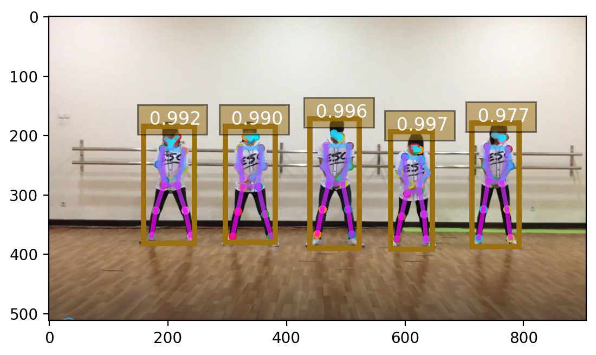

# ml5
ml5 is useful for using tensorflow.js. A posenet example is shown.
<pre>
Download rednose.tar and expand it on desktop. click index.html using firefox, chrome, or opera.

$ tar xvf rednose.tar

<a href='https://gpu.dob.jp/nosePos/index.html'> rednose position</a>

</pre>

# python-posenet

$ python simple_pose.py dance.png 

$ python yolo.py dance.png

$ python yolo.py dog.jpg

<pre>
<a href='https://storage.googleapis.com/tfjs-models/demos/posenet/camera.html'> 17 positions</a>
</pre>
<pre>
<a href='https://storage.googleapis.com/tfjs-models/demos/facemesh/index.html'> face</a>
</pre>

