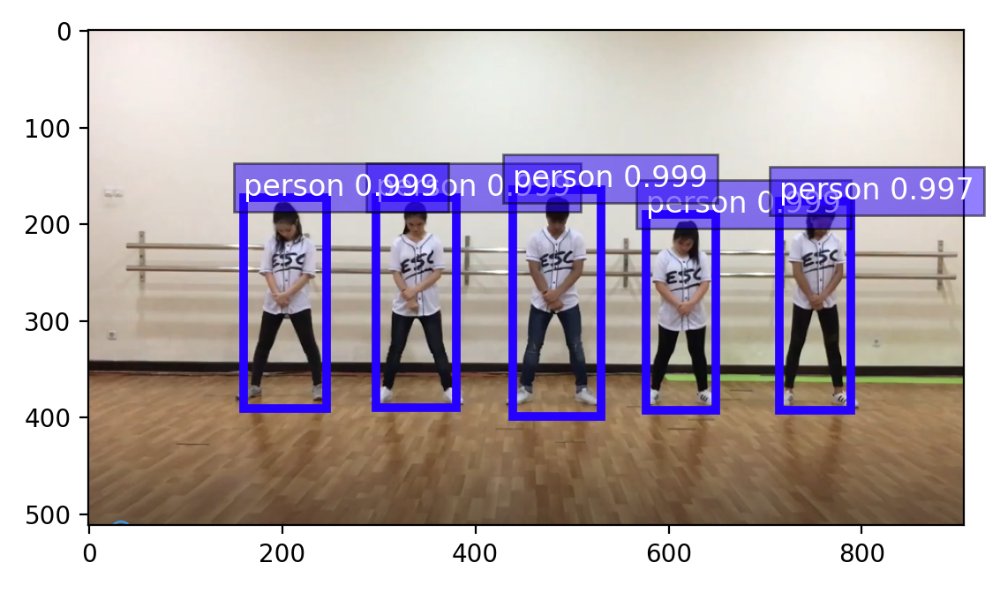
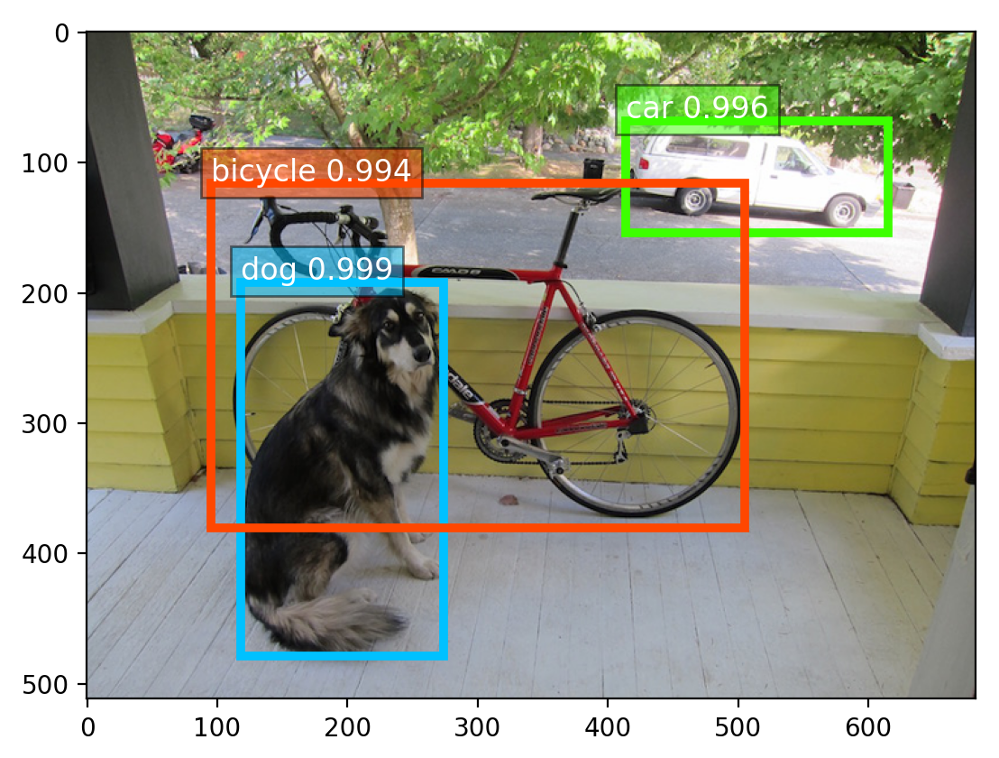
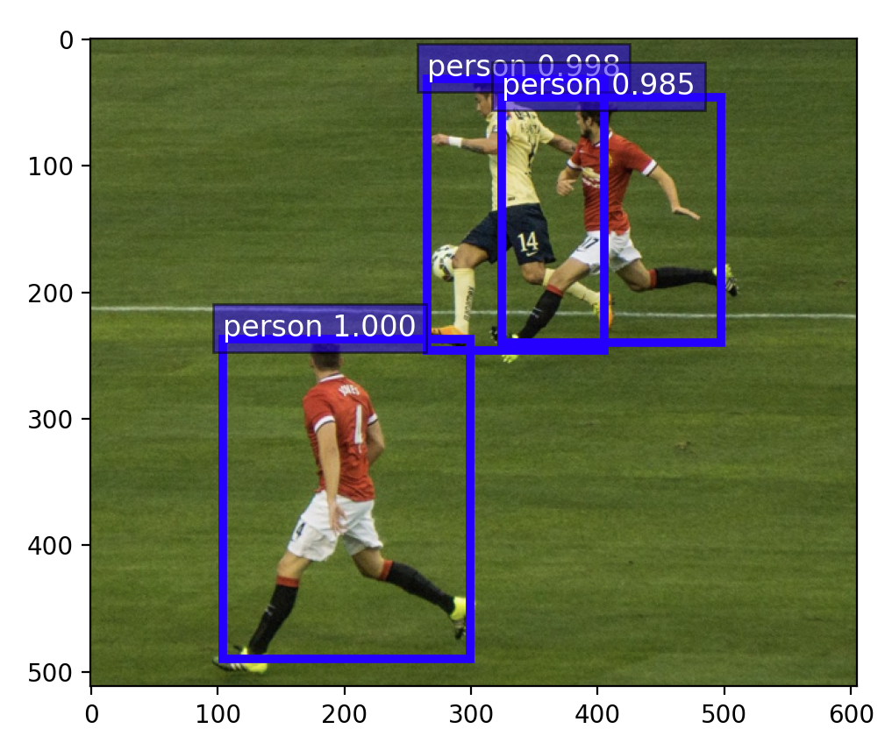

# ml5, posenet, yolo, ...
ml5 using tensorflow.js is useful for many recognition applications. A posenet example is shown.
<pre>
Download rednose.tar and expand it on desktop. click index.html using firefox, chrome, or opera.

$ tar xvf rednose.tar

</pre>
# demo site

<pre>
<a href='https://gpu1.dob.jp/nosePos/index.html'> rednose position</a>
</pre>

<pre>
<a href='https://storage.googleapis.com/tfjs-models/demos/posenet/camera.html'> 17 positions</a>
</pre>

<pre>
<a href='https://storage.googleapis.com/tfjs-models/demos/facemesh/index.html'> face</a>
</pre>

# exercises for students

1. Change my program for showing blue colored right eye instead of red nose.

2. Show the location of the blue colored right eye on the screen.

# python-posenet

$ python simple_pose.py dance.png 

$ python simple_pose.py soccer.png

# python-yolo version3

$ python yolo.py dance.png

$ python yolo.py dog.jpg

$ python yolo.py soccer.png

